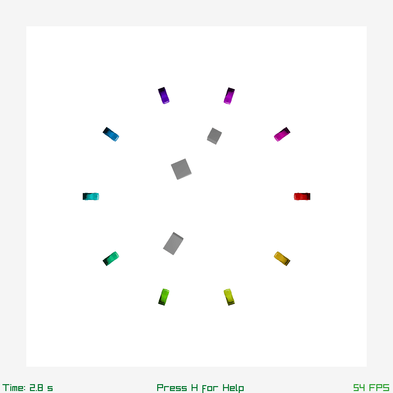

# Dynamic GBPPlanner：多机器人分布式规划(动态障碍物与各向异性扩展)

## 项目简介

本项目是对 **GBPPlanner: Distributing Multi-Robot Collaboration with Gaussian Belief Propagation** 的功能扩展，新增了对**动态障碍物**和**各向异性机器人几何**的支持。

原版项目主页: https://aalpatya.github.io/gbpplanner

<p align="center">
  
  
</p>

**核心改进**：
- ✅ **动态障碍物规避**：基于RBF核函数构建动态排斥场模型，实现对移动障碍物的平滑局部避障
- ✅ **各向异性机器人支持**：多维度差异化建模，使规划器能感知机器人朝向与运动方向，适配差速驱动、关节型等非对称构型
- ✅ **高性能实时仿真**：仿真器性能提升，包括哈希映射和空间剪裁优化。此版本支持百级机器人并发实时规划（决策延迟 < 10ms），概率性交痛模型（Poisson)，指标收集工具（flow rate, collision rate, log-dimensionless jerk, detour ratio)
- ✅ **仓储级场景验证**：在密集动态仿真环境中实现 100% 避撞率，路径平滑度媲美集中式方法

## 环境配置

### 依赖安装
通常 Linux 已包含（其他平台可能需要手动安装）：
- [OpenMP](https://www.openmp.org/)
- cmake (>=3.10)
- make

### 编译步骤
```shell
# 克隆仓库（包含子模块依赖）
git clone https://github.com/SpiderMech/Dynamic-GBPPlanner.git --recurse-submodules
cd Dynamic-GBPPlanner

# 使用 CMAKE 构建
mkdir build
cd build
cmake ..
make
```

## 运行示例

### 基础运行
修改 `config/config.json` 中的仿真参数，然后运行：
```shell
./gbpplanner
```

‼️多维度差异化需要把`N_DOFS`调为`5`

### 使用预设场景
配置文件位于 `config/` 目录：
- `config.json` - 默认场景：机器人在圆形区域内前往对角
- `circle_cluttered.json` - 静态障碍物环绕的圆形场景
- `junction.json` - 十字路口单向通行
- `junction_twoway.json` - 十字路口双向通行，支持左转、直行、右转（红、绿、蓝）
- `dynamic_obstacles.json` - 移动式障碍物

运行指定配置：
```shell
./gbpplanner --cfg ../config/junction_twoway.json
```

### 交互控制
**按 `H` 键显示帮助！**
视角控制
| 操作             | 功能        |
| -------------- | --------- |
| **鼠标滚轮**       | 缩放视角      |
| **拖拽**         | 平移视角      |
| **Shift + 拖拽** | 旋转视角      |
| **空格键**        | 切换相机关键帧动画 |

可视化层切换
| 按键    | 功能             |
| ----- | -------------- |
| **P** | 显示/隐藏机器人规划路径   |
| **R** | 显示/隐藏机器人间通信因子边 |
| **W** | 显示/隐藏导航航点      |
| **O** | 显示/隐藏障碍物       |
| **M** | 显示/隐藏机器人模型     |
| **F** | 显示/隐藏概率因子图结构   |

仿真模式控制
| 按键      | 功能                    |
| ------- | --------------------- |
| **I**   | 切换连续迭代模式（持续运行规划算法）    |
| **回车键** | 切换单步时间模式（每按一次运行一个时间步） |
| **H**   | 显示/隐藏帮助信息             |
| **ESC** | 退出程序                  |

## 自定义开发

### 添加自定义机器人编队
编辑 `src/Simulator.cpp` 末尾的 `createOrDeleteRobots()` 函数，可添加新的机器人生成逻辑。

### 添加自定义障碍物
1. 创建黑白图像（`.png` 格式），**黑色**为障碍物，**白色**为自由空间（参考 `assets/imgs`）
2. 使用脚本生成距离场图像：
   ```shell
   python assets/scripts/create_distance_field.py your_obstacle.png
   ```
3. 在配置文件中指定距离场图像路径：
   ```json
   "OBSTACLE_FILE": "assets/imgs/your_obstacle_distance.png"
   ```

## 代码教程

**原版教程视频**：https://www.youtube.com/watch?v=jvoPJ8GLiHk  
（本扩展版本API兼容，新增动态障碍物模块详见 `src/DynamicObstacle.cpp`）

## 许可证与引用

本项目基于原版GBPPlanner的许可协议。若用于学术研究，请引用原始RA-L论文：
```
@ARTICLE{gbpplanner,
        author={Patwardhan, Aalok and Murai, Riku and Davison, Andrew J.},
        journal={IEEE Robotics and Automation Letters}, 
        title={Distributing Collaborative Multi-Robot Planning With Gaussian Belief Propagation}, 
        year={2023},
        volume={8},
        number={2},
        pages={552-559},
        doi={10.1109/LRA.2022.3227858}}
```
## 技术支持
如有问题，请通过 GitHub Issues 提交，或联系项目维护者。

---

# Dynamic GBPPlanner: Distrbuted Multi-Robot Planning with Gaussian Belief Propagation with Dynamic Obstacles and Dimension Anisotropy

## Project Overview

This project extends **GBPPlanner: Distributing Multi-Robot Collaboration with Gaussian Belief Propagation** with new capabilities for **dynamic obstacle avoidance** and **anisotropic robot geometries**.

Original project page: https://aalpatya.github.io/gbpplanner

**Key Enhancements**:
- ✅ **Dynamic Obstacle Avoidance**: Implements dynamic repulsion field model based on RBF kernel functions for smooth local avoidance of moving obstacles
- ✅ **Anisotropic Robot Support**: Multi-dimensional differential modeling enables the planner to perceive robot heading and motion direction, suitable for differential drive, articulated arms, and other asymmetric configurations
- ✅ **High-Performance Real-Time Simulation**: Enhanced simulator with hash mapping and spatial clipping optimization. This version supports concurrent real-time planning for hundreds of robots (decision latency < 10ms), probabilistic traffic models (Poisson), and metrics collection tools (flow rate, collision rate, log-dimensionless jerk, detour ratio)
- ✅ **Warehouse-Scale Validation**: Achieves 100% collision-free rate in dense dynamic simulation environments with path smoothness comparable to centralized methods

---

## Environment Setup

### Dependency Installation
Typically included with Linux (may need manual installation on other platforms):
- [OpenMP](https://www.openmp.org/)
- cmake (>=3.10)
- make

### Build Instructions
```shell
# Clone repository with submodules
git clone https://github.com/SpiderMech/Dynamic-GBPPlanner.git --recurse-submodules
cd Dynamic-GBPPlanner

# Create build directory
mkdir build && cd build

# Configure and compile
cmake .. -DCMAKE_BUILD_TYPE=Release
make -j$(nproc)
```

---

## Running Examples

### Basic Execution
Modify parameters in `config/config.json` and run:
```shell
./gbpplanner
```

⚠️ **For multi-dimensional differentiation, set `N_DOFS` to `5`**

### Predefined Scenarios
Configuration files are located in `config/` directory:
- `config.json` - Default scenario: robots navigate to opposite sides of a circle
- `circle_cluttered.json` - Circular scenario with static obstacles
- `junction.json` - Unidirectional crossroad junction
- `junction_twoway.json` - Bidirectional crossroad with left/straight/right turns (red/green/blue)
- `dynamic_obstacles.json` - Moving obstacle scenario

Run specific configuration:
```shell
./gbpplanner --cfg ../config/junction_twoway.json
```

### Interactive Controls
**Press `H` for help!**

**View Controls**
| Operation | Function |
|-----------|----------|
| **Mouse Wheel** | Zoom view |
| **Drag** | Pan view |
| **Shift + Drag** | Rotate view |
| **Spacebar** | Toggle camera keyframe animation |

**Visualization Toggles**
| Key | Function |
|-----|----------|
| **P** | Show/Hide robot planning paths |
| **R** | Show/Hide inter-robot communication factor edges |
| **W** | Show/Hide navigation waypoints |
| **O** | Show/Hide obstacles |
| **M** | Show/Hide robot models |
| **F** | Show/Hide probabilistic factor graph structure |

**Simulation Mode Control**
| Key | Function |
|-----|----------|
| **I** | Toggle continuous iteration mode (planner runs continuously) |
| **Enter** | Toggle single timestep mode (one step per keypress) |
| **H** | Show/Hide help information |
| **ESC** | Exit program |

---

## Custom Development

### Adding Custom Robot Formations
Edit the `createOrDeleteRobots()` function at the end of `src/Simulator.cpp` to add new robot generation logic.

### Adding Custom Obstacles
1. Create a binary image (`.png`) with **black** obstacles on **white** background (see examples in `assets/imgs`)
2. Generate distance field image:
   ```bash
   python assets/scripts/create_distance_field.py your_obstacle.png
   ```
3. Specify the distance field image path in config:
   ```json
   "OBSTACLE_FILE": "assets/imgs/your_obstacle_distance.png"
   ```

---

## Code Tutorial

**Original tutorial video**: https://www.youtube.com/watch?v=jvoPJ8GLiHk  
(This extension maintains API compatibility; new dynamic obstacle module details are in `src/DynamicObstacle.cpp`)

---

## License and Citation

This project is based on the original GBPPlanner license. For academic use, please cite the original RA-L paper:

```bibtex
@ARTICLE{GBPPlanner2023,
  author={Alotaibi, Ahmed and Sartoretti, Guillaume},
  journal={IEEE Robotics and Automation Letters}, 
  title={Distributing Multi-Robot Collaboration With Gaussian Belief Propagation}, 
  year={2023},
  doi={10.1109/LRA.2023.3276930}}
```

---

## Technical Support

For issues or questions, please submit via [GitHub Issues](https://github.com/SpiderMech/Dynamic-GBPPlanner/issues) or contact the maintainer.

<p align="center">
  <strong>Made with ❤️ for the robotics community</strong>
</p>
